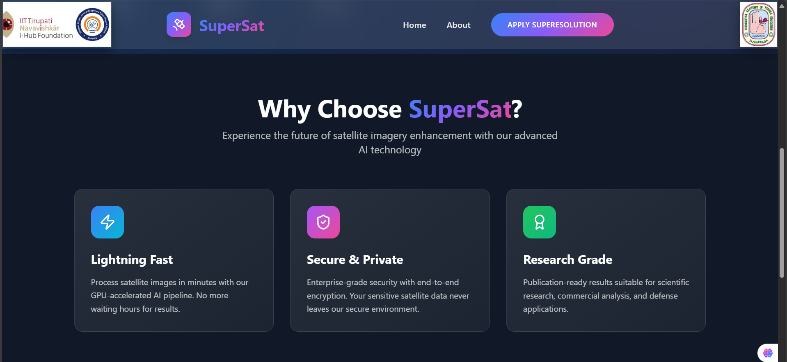

🌌 AI Super-Resolution Studio – SuperSat

  AI Super-Resolution Studio is a cutting-edge web-based tool that transforms low-resolution satellite images into high-quality visuals using advanced AI upscaling techniques.
✨ It combines deep learning models with a clean and modern UI for researchers, students, and professionals working with satellite imagery.

🚀 Features:

🔬 AI-Powered Super-Resolution – Enhance low-res satellite images with ML models.
🎨 Modern UI/UX – Built with HTML, CSS, TailwindCSS, and animations.
⚡ Flask Backend – Python-powered server for model inference and integration.
🌍 Satellite Focused – Designed for geospatial applications, research, and visualization.
📊 Interactive Dashboard – Upload, process, and visualize image transformations easily.

📂 Tech Stack

Frontend:
        HTML, CSS, TailwindCSS
        JavaScript (animations + interactivity)
Backend:
        Flask (Python)
        AI/ML Super-Resolution Model (TensorFlow / PyTorch)
Version Control: 
        Git & GitHub

🖥️ Installation & Setup

Clone the repo:

git clone https://github.com/Lakshmibhavaniyepuri/SuperSat.git
cd SuperSat

Create virtual environment & install dependencies:

python -m venv venv
source venv/Scripts/activate   # on Windows: venv\Scripts\activate
pip install -r requirements.txt

Run Flask server:

python app.py

Open in browser:

http://127.0.0.1:5000

📸 Screenshots (Optional)

👉 (Here you can add images of your About Page, Dashboard, or Super-Resolution results.)

📜 License

This project "SuperSat – AI Super-Resolution Studio" has been developed as part of an internship and is intended
solely for academic and educational purposes

🤝 Contributing

Pull requests are welcome! For major changes, please open an issue first to discuss what you’d like to change.

🌟 Acknowledgements

Sentinel & Landsat Satellite Datasets
TensorFlow / PyTorch AI Frameworks
Flask Web Development
